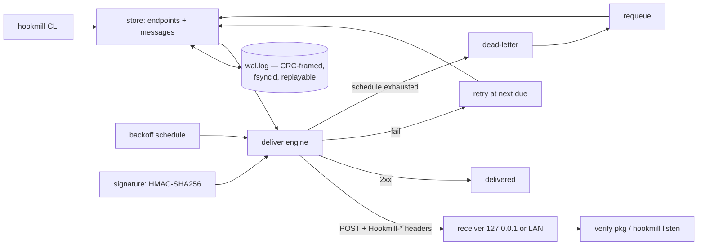

# hookmill

[English](README.md) | [中文](README.zh.md) | [日本語](README.ja.md)

[](LICENSE) [](go.mod) [](CHANGELOG.md)  [](CONTRIBUTING.md)

**hookmill：オープンソースの単一バイナリ送信 webhook 配信サービス —— HMAC 署名付き配信、バックオフ付きリトライ、デッドレターキュー、受信側検証ヘルパーを備え、全状態をファイルベースのライトアヘッドログ（WAL）1 つに保存。**


```bash
git clone https://github.com/JaydenCJ/hookmill && cd hookmill
go build -o hookmill ./cmd/hookmill    # single static binary, stdlib only
```

> プレリリース：v0.1.0 はまだどのパッケージレジストリにも公開されていません。上記のとおりソースからビルドしてください（Go ≥1.22 で可）。

## なぜ hookmill？

webhook を*確実に*送ること自体は解決済みの問題ですが、そのデプロイ方法は未解決のままです。正しくやるには、タイムスタンプ付き HMAC 署名（受信側が偽造とリプレイを拒否できるように）、バックオフ付きリトライ（受信側は落ちるもの）、デッドレターキュー（永遠に届かない配信もある）、そして監査記録（サポートは必ず「本当に送った？」と聞いてくる）が必要です。Svix はまさにこの機能一式をサービス化して普及させました——しかしセルフホストするには、せいぜい数千件の小さなレコードのために Postgres と Redis を運用することになります。cron の手書き `curl` はその逆で、署名もバックオフもなく、失敗は誰も grep しないログに眠るだけ。hookmill はその中間を埋めます：エンドポイント・シークレット・メッセージ・全試行というすべての状態が、チェックサム付きで書きかけ耐性があり `cat` できる 1 つのライトアヘッドログに収まる Go バイナリ 1 個。大手サービスと同じ方式で署名し（タイムスタンプ付き HMAC-SHA256、二重署名ウィンドウでのシークレットローテーション）、読める明示的スケジュールでリトライし、引用可能な試行履歴付きでデッドレター化し、受信側検証器——インポート可能な Go パッケージ、CLI、内蔵ループバックテストサーバ——まで同梱します。

| | hookmill | Svix（セルフホスト） | cron + curl スクリプト | RabbitMQ/キュー自作 |
|---|---|---|---|---|
| 署名付き配信（タイムスタンプ付き HMAC） | ✅ | ✅ | ❌ 自作 | ❌ 自作 |
| 検証を切らさないシークレットローテーション | ✅ 二重署名ウィンドウ | ✅ | ❌ | ❌ |
| バックオフ付きリトライ + デッドレターキュー | ✅ | ✅ | ❌ | broker のリトライのみ |
| 受信側検証ヘルパー同梱 | ✅ パッケージ + CLI + テストサーバ | ライブラリ | ❌ | ❌ |
| 必要なインフラ | なし——バイナリ 1 個、ファイル 1 個 | Postgres + Redis | cron | broker クラスタ |
| 状態を `cat`/`grep` で直接確認 | ✅ 行指向 WAL | ❌ | ログなら多分 | ❌ |
| ランタイム依存 | 0 | サーバ + データストア 2 つ | curl | クライアントライブラリ + broker |

<sub>2026-07-13 確認：hookmill は Go 標準ライブラリのみをインポート。Svix サーバのセルフホスト文書は PostgreSQL と Redis を要求。</sub>

## 特徴

- **ゼロインフラ** —— データベースも broker も常駐プロセスも不要：状態は追記専用 WAL（`wal.log`）1 つ。CRC フレーミング、追記ごとの fsync、末尾破損の修復、アトミックなコンパクション付き。
- **受信側が信頼できる署名** —— `id.timestamp.body` へのタイムスタンプ付き HMAC-SHA256、定数時間比較、5 分のスキュー窓によるリプレイ対策、旧シークレットを退役させるまで新旧両方で署名するローテーション。
- **検証は同梱、宿題にしない** —— インポート可能な `verify` Go パッケージ（`verify.Request(r, secret, nil)` の 1 行で完了）、任意言語のデバッグに使える `hookmill sign`/`verify` CLI、実配信を検証するループバック受信器 `hookmill listen`。
- **読めるリトライ** —— バックオフスケジュールは明示的なリスト（既定 `5s,30s,2m,10m,1h,6h,24h`、`none` で 1 回きり）。使い切るとメッセージは全試行履歴付きでデッドレター化され、`requeue` は履歴を消さずにキューへ戻します。
- **正直な失敗処理** —— 非 2xx もトランスポートエラーも失敗として数える。エンドポイント削除は保留メッセージを隠さずデッドレター化。試行ごとにステータス・エラー・所要時間を記録。
- **決定的で監査可能** —— WAL のリプレイで状態をバイト単位に再構築（テストで保証）、メッセージはバイト同一に保存/署名/配信、`status`/`inspect`/`dead` はすべて `--format json` 対応。
- **運用が退屈** —— 既定でループバックにのみバインドし、設定したエンドポイント URL 以外へは何も、どこへも、決して送信しません。

## クイックスタート

```bash
hookmill init
hookmill endpoint add billing --url http://127.0.0.1:8811/hooks
hookmill enqueue billing --type invoice.paid --data '{"invoice":"inv_1042","total_cents":129900,"currency":"JPY"}'
hookmill listen --secret hmsec_… --max 1 &   # your receiver, or this built-in one
hookmill deliver
```

実際にキャプチャした出力：

```text
initialized .hookmill (schedule 5s,30s,2m,10m,1h,6h,24h — max 8 attempts per message)
endpoint billing
  url     http://127.0.0.1:8811/hooks
  secret  hmsec_AAAAAAAAAAAAAAAAAAAAAAAAAAAAAAAA
store the secret in your receiver; hookmill signs every delivery with it
enqueued msg_c97eb11956d7be70 → billing (invoice.paid, 60 bytes, due now)
listening on http://127.0.0.1:8811 (verifying hookmill deliveries)
ok   msg_c97eb11956d7be70  invoice.paid  60 bytes
msg_c97eb11956d7be70  billing  attempt 1  →  204  delivered  (1ms)
summary: 1 delivered, 0 retried, 0 dead
```

受信側がダウンしていれば、配信は設定どおりに劣化します（実出力）：

```text
msg_7bf28b96a9d33f57  billing  attempt 1  →  error: Post "http://127.0.0.1:8811/hooks": dial tcp 127.0.0.1:8811: connect: connection refused  retry (due 2026-07-13T05:19:42Z)
summary: 0 delivered, 1 retried, 0 dead
```

cron（または `--drain` ループ）で `hookmill deliver` を配信ティックとして実行し、`status`・`inspect <id>`・`dead`・`requeue` で日常運用をカバーします。

## 配信の検証

受信側は同じ方式を 3 通りで検証できます（仕様：[docs/signing.md](docs/signing.md)）：

```go
import "github.com/JaydenCJ/hookmill/verify"

func hooks(w http.ResponseWriter, r *http.Request) {
    ev, err := verify.Request(r, os.Getenv("HOOKMILL_SECRET"), nil)
    if err != nil { http.Error(w, "bad signature", 401); return }
    // ev.ID, ev.Type, ev.Body are authenticated; ack with any 2xx.
}
```

| ヘッダ | 例 |
|---|---|
| `Hookmill-Id` | `msg_c97eb11956d7be70` |
| `Hookmill-Timestamp` | `1784092777`（unix 秒、試行ごとに再署名） |
| `Hookmill-Signature` | `v1=Z/27T4NcivOdZmlvVYP2WxPcbnz3vrK8njl5mDy48D8=` |
| `Hookmill-Event` | `invoice.paid` |

Go 以外の受信側は 4 ステップ（ヘッダ欠落を拒否 → タイムスタンプのずれを確認 → `id.timestamp.body` に定数時間 HMAC-SHA256 → いずれかの `v1=` エントリ一致で受理）を実装すればよく、コマンドラインの `hookmill sign` / `hookmill verify` と突き合わせてテストできます。

## CLI リファレンス

`hookmill <command> [flags]` —— 終了コード：0 成功、1 検証失敗、2 使い方エラー、3 実行時エラー。`--dir`（または `$HOOKMILL_DIR`）でデータディレクトリを選択、既定は `.hookmill`。

| コマンド | 効果 |
|---|---|
| `init [--schedule 5s,30s,…\|none]` | データディレクトリと WAL をリトライスケジュール付きで作成 |
| `endpoint add\|list\|remove\|rotate` | 配信先を管理。`rotate` は切替期間中に二重署名 |
| `enqueue <ep> --type T [--data J]` | ペイロードを投入（stdin パイプも可）、即時に配信対象 |
| `deliver [--drain] [--limit N] [--timeout D]` | 期限到来分をすべて試行。`--drain` は空になるまでループ |
| `status` / `inspect <id>` / `dead` | キュー集計、メッセージごとの試行履歴、デッドレター一覧 |
| `requeue <id>…\|--all` | デッド → 保留、連続失敗カウントをリセット、履歴は保持 |
| `compact` | WAL をスナップショットレコード 1 件にアトミックに書き直し |
| `sign` / `verify` | stdin のペイロードを署名/検証（不一致時は終了コード 1） |
| `listen [--fail-first N] [--max N]` | 受信配信を検証するループバック受信器 |

## 検証

このリポジトリは CI を同梱しません。上記の主張はすべてローカル実行で検証されています：

```bash
go test ./...            # 89 deterministic tests, offline, < 5 s
bash scripts/smoke.sh    # full delivery cycle against a real loopback receiver, prints SMOKE OK
```

## アーキテクチャ



## ロードマップ

- [x] v0.1.0 —— WAL キュー、タイムスタンプ付き HMAC 署名 + ローテーション、スケジュール駆動リトライ、デッドレター + requeue、受信側 verify パッケージ/CLI/リスナー、89 テスト + smoke スクリプト
- [ ] ジッター付きウェイクアップの常駐モード `deliver --watch`
- [ ] エンドポイントごとのスケジュール・タイムアウト上書き
- [ ] 自動コンパクション閾値（`--auto-compact-bytes`）
- [ ] Python/TypeScript 受信側向け検証スニペットを `docs/` に追加
- [ ] サポートツール向け配信ログエクスポート（`hookmill log --since`）

全リストは [open issues](https://github.com/JaydenCJ/hookmill/issues) を参照。

## コントリビュート

issue・ディスカッション・PR を歓迎します —— ローカルワークフロー（フォーマット、vet、テスト、`SMOKE OK`）は [CONTRIBUTING.md](CONTRIBUTING.md) を参照。入門タスクは [good first issue](https://github.com/JaydenCJ/hookmill/issues?q=is%3Aissue+is%3Aopen+label%3A%22good+first+issue%22) のラベル付き、設計の議論は [Discussions](https://github.com/JaydenCJ/hookmill/discussions) で。

## ライセンス

[MIT](LICENSE)
