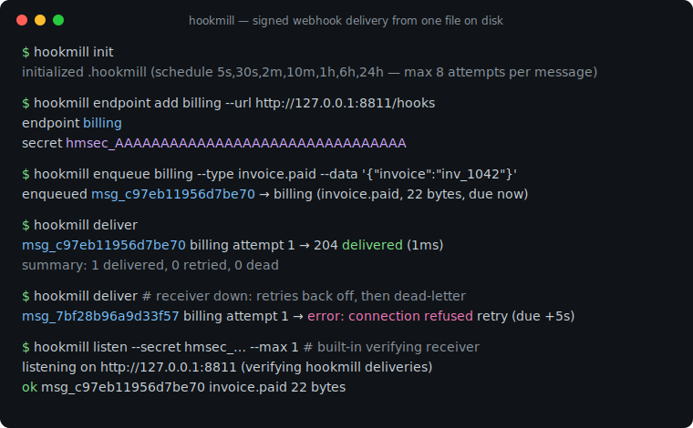
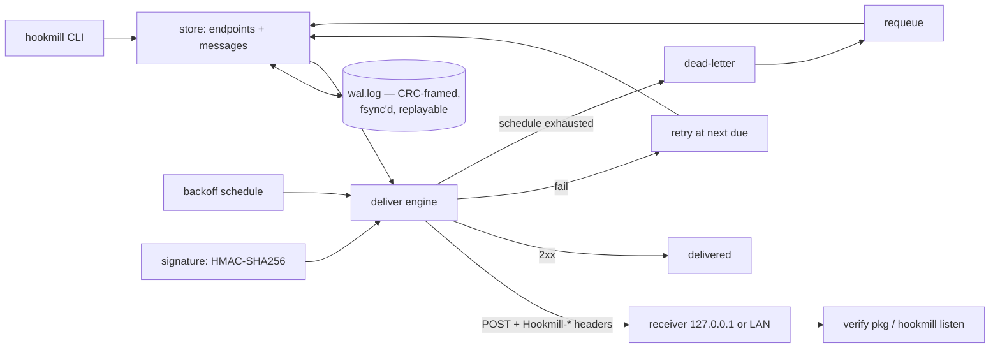

# hookmill

[English](README.md) | [中文](README.zh.md) | [日本語](README.ja.md)

[](LICENSE) [](go.mod) [](CHANGELOG.md)  [](CONTRIBUTING.md)

**hookmill：an open-source outbound webhook delivery service in a single binary — HMAC-signed deliveries, retry with backoff, a dead-letter queue, and receiver-side verification helpers, with all state in one file-backed write-ahead log.**



```bash
git clone https://github.com/JaydenCJ/hookmill && cd hookmill
go build -o hookmill ./cmd/hookmill    # single static binary, stdlib only
```

> Pre-release: v0.1.0 is not tagged on a package registry yet; build from source as above (any Go ≥1.22).

## Why hookmill?

Sending webhooks *reliably* is a solved problem with an unsolved deployment story. Doing it right means HMAC signatures with timestamps (so receivers can reject forgeries and replays), retries with backoff (receivers go down), a dead-letter queue (some deliveries never succeed), and an audit trail (support will ask "did you send it?"). Svix popularized exactly this feature set as a service — but self-hosting it means running Postgres and Redis for what is, at most self-hosted scales, a few thousand small records. Hand-rolled `curl` in a cron job has the opposite problem: no signatures, no backoff, and a failure story that ends in a log file nobody greps. hookmill is the missing middle: one Go binary whose entire state — endpoints, secrets, messages, every attempt — lives in a single checksummed, torn-write-safe write-ahead log you can `cat`. It signs like the big services do (timestamped HMAC-SHA256, secret rotation with dual-signature windows), retries on an explicit schedule you can read, dead-letters with quotable attempt history, and ships the receiver-side verifier — as an importable Go package, a CLI, and a built-in loopback test server.

| | hookmill | Svix (self-hosted) | cron + curl script | RabbitMQ/queue DIY |
|---|---|---|---|---|
| Signed deliveries (timestamped HMAC) | ✅ | ✅ | ❌ DIY | ❌ DIY |
| Secret rotation without dropped verifications | ✅ dual-sign window | ✅ | ❌ | ❌ |
| Retry with backoff + dead-letter queue | ✅ | ✅ | ❌ | broker retries only |
| Receiver-side verification helpers included | ✅ pkg + CLI + test server | libs | ❌ | ❌ |
| Infrastructure required | none — one binary, one file | Postgres + Redis | cron | broker cluster |
| State inspectable with `cat`/`grep` | ✅ line-oriented WAL | ❌ | logs, maybe | ❌ |
| Runtime dependencies | 0 | server + 2 datastores | curl | client lib + broker |

<sub>Checked 2026-07-13: hookmill imports the Go standard library only; the Svix server's self-hosting docs require PostgreSQL and Redis.</sub>

## Features

- **Zero infrastructure** — no database, no broker, no daemon required: state is one append-only WAL (`wal.log`) with CRC-framed records, fsync on every append, torn-tail repair, and atomic compaction.
- **Signatures receivers can trust** — timestamped HMAC-SHA256 over `id.timestamp.body`, constant-time verification, replay protection via a 5-minute skew window, and rotation that signs with old + new secrets until you retire the old one.
- **Verification included, not homework** — an importable `verify` Go package (`verify.Request(r, secret, nil)` and done), a `hookmill sign`/`verify` CLI pair for any-language debugging, and `hookmill listen`, a loopback receiver that verifies real deliveries.
- **Retries you can read** — the backoff schedule is an explicit list (`5s,30s,2m,10m,1h,6h,24h` by default, `none` for one-shot); exhaustion dead-letters the message with its full attempt history, and `requeue` puts it back without erasing that history.
- **Honest failure handling** — non-2xx and transport errors both count as failures; removing an endpoint dead-letters its pending messages instead of hiding them; every attempt records status, error, and duration.
- **Deterministic and auditable** — replaying the WAL reconstructs state byte-for-byte (tested), messages are stored/signed/delivered byte-identical, and `status`/`inspect`/`dead` all speak `--format json`.
- **Boring to operate** — binds loopback by default, talks only to the endpoint URLs you configured, sends nothing anywhere else, ever.

## Quickstart

```bash
hookmill init
hookmill endpoint add billing --url http://127.0.0.1:8811/hooks
hookmill enqueue billing --type invoice.paid --data '{"invoice":"inv_1042","total_cents":129900,"currency":"JPY"}'
hookmill listen --secret hmsec_… --max 1 &   # your receiver, or this built-in one
hookmill deliver
```

Real captured output:

```text
initialized .hookmill (schedule 5s,30s,2m,10m,1h,6h,24h — max 8 attempts per message)
endpoint billing
  url     http://127.0.0.1:8811/hooks
  secret  hmsec_AAAAAAAAAAAAAAAAAAAAAAAAAAAAAAAA
store the secret in your receiver; hookmill signs every delivery with it
enqueued msg_c97eb11956d7be70 → billing (invoice.paid, 60 bytes, due now)
listening on http://127.0.0.1:8811 (verifying hookmill deliveries)
ok   msg_c97eb11956d7be70  invoice.paid  60 bytes
msg_c97eb11956d7be70  billing  attempt 1  →  204  delivered  (1ms)
summary: 1 delivered, 0 retried, 0 dead
```

When the receiver is down, delivery degrades exactly as configured (real output):

```text
msg_7bf28b96a9d33f57  billing  attempt 1  →  error: Post "http://127.0.0.1:8811/hooks": dial tcp 127.0.0.1:8811: connect: connection refused  retry (due 2026-07-13T05:19:42Z)
summary: 0 delivered, 1 retried, 0 dead
```

Run `hookmill deliver` from cron (or a `--drain` loop) as your delivery tick; `status`, `inspect <id>`, `dead`, and `requeue` cover the day-2 operations.

## Verifying deliveries

Receivers get three ways to check the same scheme (spec: [docs/signing.md](docs/signing.md)):

```go
import "github.com/JaydenCJ/hookmill/verify"

func hooks(w http.ResponseWriter, r *http.Request) {
    ev, err := verify.Request(r, os.Getenv("HOOKMILL_SECRET"), nil)
    if err != nil { http.Error(w, "bad signature", 401); return }
    // ev.ID, ev.Type, ev.Body are authenticated; ack with any 2xx.
}
```

| Header | Example |
|---|---|
| `Hookmill-Id` | `msg_c97eb11956d7be70` |
| `Hookmill-Timestamp` | `1784092777` (unix seconds, re-signed per attempt) |
| `Hookmill-Signature` | `v1=Z/27T4NcivOdZmlvVYP2WxPcbnz3vrK8njl5mDy48D8=` |
| `Hookmill-Event` | `invoice.paid` |

Non-Go receivers implement four steps (reject missing headers → check timestamp skew → constant-time HMAC-SHA256 over `id.timestamp.body` → accept any matching `v1=` entry) and can test against `hookmill sign` / `hookmill verify` on the command line.

## CLI reference

`hookmill <command> [flags]` — exit codes: 0 ok, 1 verification failure, 2 usage error, 3 runtime error. `--dir` (or `$HOOKMILL_DIR`) selects the data directory, default `.hookmill`.

| Command | Effect |
|---|---|
| `init [--schedule 5s,30s,…\|none]` | create the data dir and WAL with a retry schedule |
| `endpoint add\|list\|remove\|rotate` | manage delivery targets; `rotate` dual-signs during switchover |
| `enqueue <ep> --type T [--data J]` | queue a payload (or pipe it via stdin), due immediately |
| `deliver [--drain] [--limit N] [--timeout D]` | attempt everything due now; `--drain` loops until quiet |
| `status` / `inspect <id>` / `dead` | queue totals, per-message attempt history, dead-letter list |
| `requeue <id>…\|--all` | dead → pending, fail streak reset, history kept |
| `compact` | rewrite the WAL as one snapshot record, atomically |
| `sign` / `verify` | sign or check a payload from stdin (verify exits 1 on mismatch) |
| `listen [--fail-first N] [--max N]` | loopback receiver that verifies incoming deliveries |

## Verification

This repository ships no CI; every claim above is verified by local runs:

```bash
go test ./...            # 89 deterministic tests, offline, < 5 s
bash scripts/smoke.sh    # full delivery cycle against a real loopback receiver, prints SMOKE OK
```

## Architecture



## Roadmap

- [x] v0.1.0 — WAL-backed queue, timestamped HMAC signing + rotation, schedule-driven retries, dead-letter + requeue, receiver verify pkg/CLI/listener, 89 tests + smoke script
- [ ] `deliver --watch` long-running mode with jittered wakeups
- [ ] Per-endpoint schedule and timeout overrides
- [ ] Automatic compaction threshold (`--auto-compact-bytes`)
- [ ] Verification helper snippets for Python/TypeScript receivers in `docs/`
- [ ] Delivery log export (`hookmill log --since`) for support tooling

See the [open issues](https://github.com/JaydenCJ/hookmill/issues) for the full list.

## Contributing

Issues, discussions and pull requests are welcome — see [CONTRIBUTING.md](CONTRIBUTING.md) for the local workflow (format, vet, tests, `SMOKE OK`). Good entry points are labelled [good first issue](https://github.com/JaydenCJ/hookmill/issues?q=is%3Aissue+is%3Aopen+label%3A%22good+first+issue%22), and design questions live in [Discussions](https://github.com/JaydenCJ/hookmill/discussions).

## License

[MIT](LICENSE)
