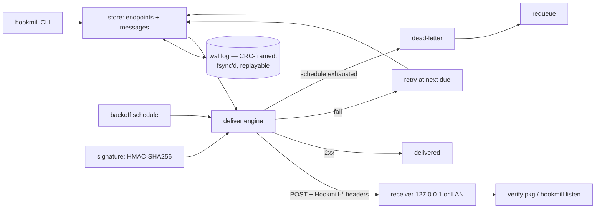

# hookmill

[English](README.md) | [中文](README.zh.md) | [日本語](README.ja.md)

[](LICENSE) [](go.mod) [](CHANGELOG.md)  [](CONTRIBUTING.md)

**hookmill：开源的单二进制出站 webhook 投递服务 —— HMAC 签名投递、带退避的重试、死信队列、接收端验签助手，全部状态存于一个基于文件的预写日志（WAL）。**


```bash
git clone https://github.com/JaydenCJ/hookmill && cd hookmill
go build -o hookmill ./cmd/hookmill    # single static binary, stdlib only
```

> 预发布：v0.1.0 尚未发布到任何包仓库；请按上述方式从源码构建（Go ≥1.22 即可）。

## 为什么选 hookmill？

*可靠地*发送 webhook 是个已被解决的问题，但部署方案一直没解决好。要做对，就需要带时间戳的 HMAC 签名（让接收方能拒绝伪造与重放）、带退避的重试（接收方会宕机）、死信队列（有些投递永远不会成功），以及审计记录（客服总会问"你到底发了没？"）。Svix 正是把这套功能做成了服务并使其流行——但自托管它意味着为区区几千条小记录跑起 Postgres 和 Redis。手写 `curl` 加 cron 则是反面：没有签名、没有退避，失败最后只躺在一份没人 grep 的日志里。hookmill 补上了中间的空档：一个 Go 二进制，全部状态——端点、密钥、消息、每次尝试——都存在一个带校验和、耐撕裂写入、可以直接 `cat` 的预写日志里。它像大型服务一样签名（带时间戳的 HMAC-SHA256、双签名窗口的密钥轮换），按一份你读得懂的显式计划重试，死信附带可引用的尝试历史，并且随附接收端验签器——可导入的 Go 包、CLI，以及内置的回环测试服务器。

| | hookmill | Svix（自托管） | cron + curl 脚本 | RabbitMQ/队列自研 |
|---|---|---|---|---|
| 签名投递（带时间戳的 HMAC） | ✅ | ✅ | ❌ 自己实现 | ❌ 自己实现 |
| 密钥轮换不中断验签 | ✅ 双签名窗口 | ✅ | ❌ | ❌ |
| 带退避的重试 + 死信队列 | ✅ | ✅ | ❌ | 仅 broker 重试 |
| 随附接收端验签助手 | ✅ 包 + CLI + 测试服务器 | 有库 | ❌ | ❌ |
| 所需基础设施 | 无——一个二进制、一个文件 | Postgres + Redis | cron | broker 集群 |
| 状态可用 `cat`/`grep` 直接查看 | ✅ 行式 WAL | ❌ | 也许有日志 | ❌ |
| 运行时依赖 | 0 | 服务端 + 2 个存储 | curl | 客户端库 + broker |

<sub>核对于 2026-07-13：hookmill 仅导入 Go 标准库；Svix 服务端的自托管文档要求 PostgreSQL 与 Redis。</sub>

## 特性

- **零基础设施** —— 不需要数据库、broker 或常驻进程：状态就是一个只追加的 WAL（`wal.log`），CRC 帧格式、每次追加都 fsync、尾部撕裂修复、原子压实。
- **接收方可信赖的签名** —— 对 `id.timestamp.body` 做带时间戳的 HMAC-SHA256，常量时间比较，5 分钟偏移窗口防重放，轮换期间新旧密钥同时签名，直到你退役旧密钥。
- **验签是随附的，不是作业** —— 可导入的 `verify` Go 包（一句 `verify.Request(r, secret, nil)` 搞定）、供任意语言调试的 `hookmill sign`/`verify` CLI，以及验证真实投递的回环接收器 `hookmill listen`。
- **读得懂的重试** —— 退避计划就是一份显式列表（默认 `5s,30s,2m,10m,1h,6h,24h`，`none` 表示只发一次）；计划耗尽即死信并保留完整尝试历史，`requeue` 放回队列且不抹掉历史。
- **诚实的失败处理** —— 非 2xx 与传输错误都算失败；删除端点会把其待投消息死信化而不是藏起来；每次尝试都记录状态码、错误与耗时。
- **确定性、可审计** —— 重放 WAL 可逐字节重建状态（有测试保证），消息按字节原样存储/签名/投递，`status`/`inspect`/`dead` 都支持 `--format json`。
- **运维上很无聊** —— 默认只绑定回环地址，只连接你配置的端点 URL，除此之外永远不向任何地方发送任何东西。

## 快速上手

```bash
hookmill init
hookmill endpoint add billing --url http://127.0.0.1:8811/hooks
hookmill enqueue billing --type invoice.paid --data '{"invoice":"inv_1042","total_cents":129900,"currency":"JPY"}'
hookmill listen --secret hmsec_… --max 1 &   # your receiver, or this built-in one
hookmill deliver
```

真实抓取的输出：

```text
initialized .hookmill (schedule 5s,30s,2m,10m,1h,6h,24h — max 8 attempts per message)
endpoint billing
  url     http://127.0.0.1:8811/hooks
  secret  hmsec_AAAAAAAAAAAAAAAAAAAAAAAAAAAAAAAA
store the secret in your receiver; hookmill signs every delivery with it
enqueued msg_c97eb11956d7be70 → billing (invoice.paid, 60 bytes, due now)
listening on http://127.0.0.1:8811 (verifying hookmill deliveries)
ok   msg_c97eb11956d7be70  invoice.paid  60 bytes
msg_c97eb11956d7be70  billing  attempt 1  →  204  delivered  (1ms)
summary: 1 delivered, 0 retried, 0 dead
```

接收方宕机时，投递严格按配置降级（真实输出）：

```text
msg_7bf28b96a9d33f57  billing  attempt 1  →  error: Post "http://127.0.0.1:8811/hooks": dial tcp 127.0.0.1:8811: connect: connection refused  retry (due 2026-07-13T05:19:42Z)
summary: 0 delivered, 1 retried, 0 dead
```

用 cron（或 `--drain` 循环）跑 `hookmill deliver` 作为投递节拍；`status`、`inspect <id>`、`dead`、`requeue` 覆盖日常运维。

## 验证投递

接收方有三种方式校验同一套方案（规范见 [docs/signing.md](docs/signing.md)）：

```go
import "github.com/JaydenCJ/hookmill/verify"

func hooks(w http.ResponseWriter, r *http.Request) {
    ev, err := verify.Request(r, os.Getenv("HOOKMILL_SECRET"), nil)
    if err != nil { http.Error(w, "bad signature", 401); return }
    // ev.ID, ev.Type, ev.Body are authenticated; ack with any 2xx.
}
```

| 请求头 | 示例 |
|---|---|
| `Hookmill-Id` | `msg_c97eb11956d7be70` |
| `Hookmill-Timestamp` | `1784092777`（unix 秒，每次尝试重新签名） |
| `Hookmill-Signature` | `v1=Z/27T4NcivOdZmlvVYP2WxPcbnz3vrK8njl5mDy48D8=` |
| `Hookmill-Event` | `invoice.paid` |

非 Go 接收方只需实现四步（缺请求头即拒绝 → 检查时间戳偏移 → 对 `id.timestamp.body` 做常量时间 HMAC-SHA256 → 任一 `v1=` 条目匹配即接受），并可在命令行用 `hookmill sign` / `hookmill verify` 对拍。

## CLI 参考

`hookmill <command> [flags]` —— 退出码：0 成功，1 验签失败，2 用法错误，3 运行时错误。`--dir`（或 `$HOOKMILL_DIR`）选择数据目录，默认 `.hookmill`。

| 命令 | 作用 |
|---|---|
| `init [--schedule 5s,30s,…\|none]` | 创建数据目录与 WAL，并设定重试计划 |
| `endpoint add\|list\|remove\|rotate` | 管理投递目标；`rotate` 在切换期双签名 |
| `enqueue <ep> --type T [--data J]` | 入队一个载荷（也可从 stdin 管道输入），立即到期 |
| `deliver [--drain] [--limit N] [--timeout D]` | 尝试当前所有到期消息；`--drain` 循环直到清空 |
| `status` / `inspect <id>` / `dead` | 队列汇总、单条消息尝试历史、死信列表 |
| `requeue <id>…\|--all` | 死信 → 待投，失败连击清零，历史保留 |
| `compact` | 把 WAL 原子重写为单条快照记录 |
| `sign` / `verify` | 对 stdin 载荷签名或校验（校验不匹配时退出码 1） |
| `listen [--fail-first N] [--max N]` | 验证入站投递的回环接收器 |

## 验证

本仓库不附带 CI；上述所有声明均由本地运行验证：

```bash
go test ./...            # 89 deterministic tests, offline, < 5 s
bash scripts/smoke.sh    # full delivery cycle against a real loopback receiver, prints SMOKE OK
```

## 架构



## 路线图

- [x] v0.1.0 —— WAL 队列、带时间戳的 HMAC 签名 + 轮换、按计划的重试、死信 + requeue、接收端 verify 包/CLI/监听器、89 个测试 + smoke 脚本
- [ ] `deliver --watch` 常驻模式，带抖动唤醒
- [ ] 端点级的计划与超时覆盖
- [ ] 自动压实阈值（`--auto-compact-bytes`）
- [ ] 在 `docs/` 提供 Python/TypeScript 接收端验签示例片段
- [ ] 投递日志导出（`hookmill log --since`）供支持工具使用

完整列表见 [open issues](https://github.com/JaydenCJ/hookmill/issues)。

## 参与贡献

欢迎 issue、讨论与 PR —— 本地工作流（格式化、vet、测试、`SMOKE OK`）见 [CONTRIBUTING.md](CONTRIBUTING.md)。入门任务标注为 [good first issue](https://github.com/JaydenCJ/hookmill/issues?q=is%3Aissue+is%3Aopen+label%3A%22good+first+issue%22)，设计讨论在 [Discussions](https://github.com/JaydenCJ/hookmill/discussions)。

## 许可证

[MIT](LICENSE)
